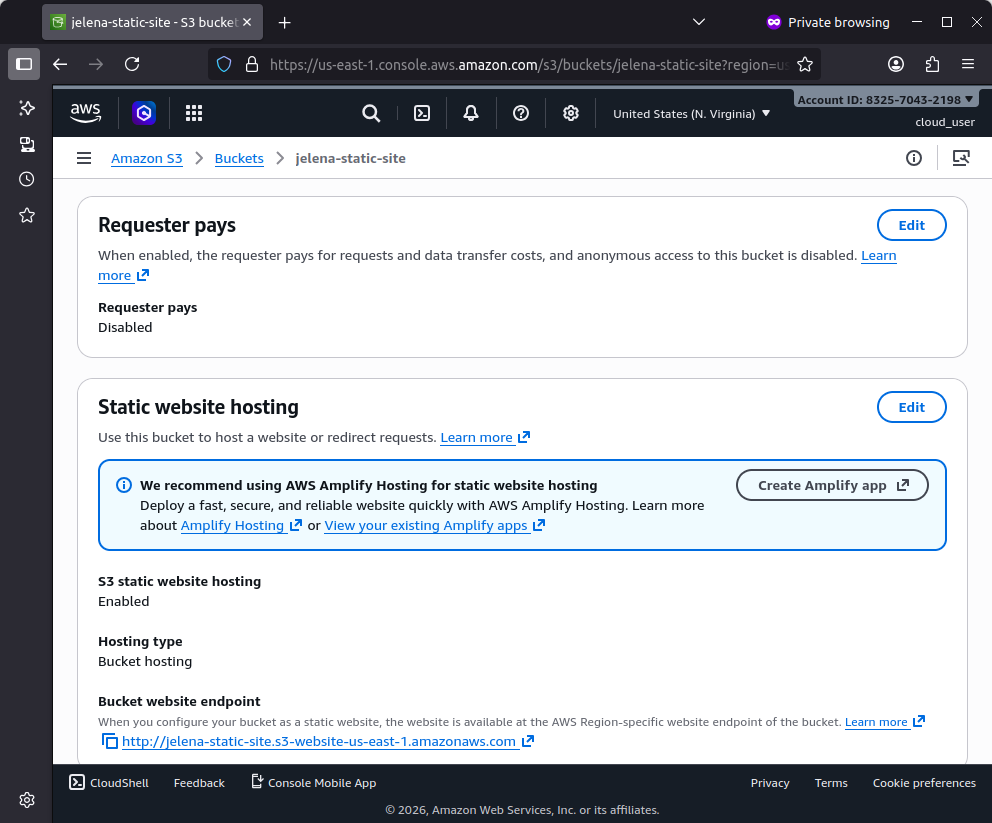
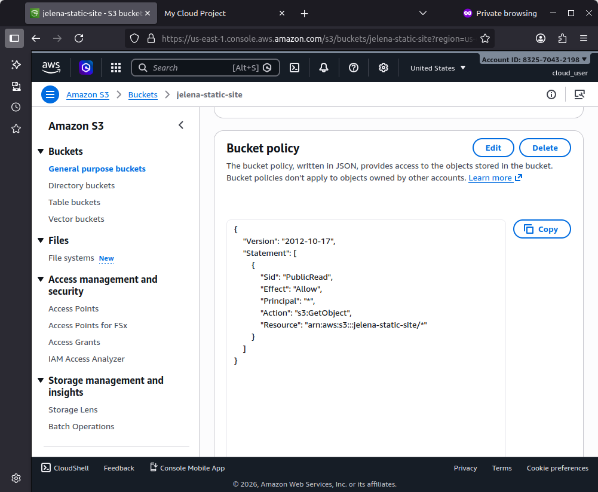
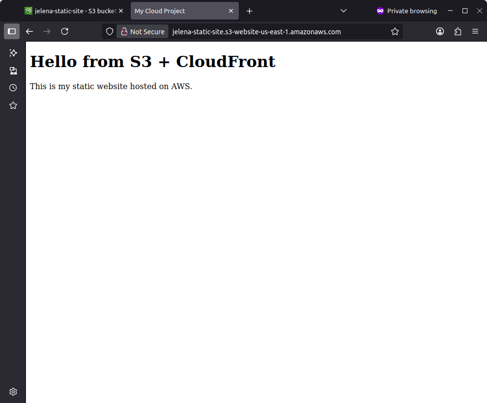
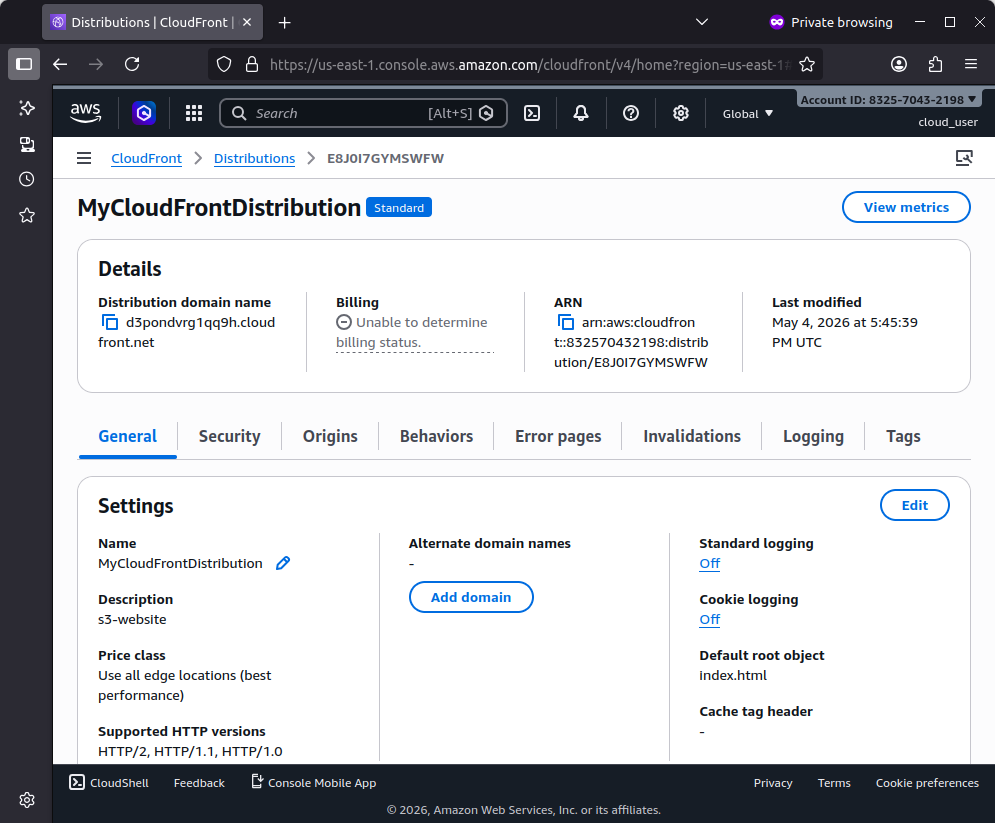
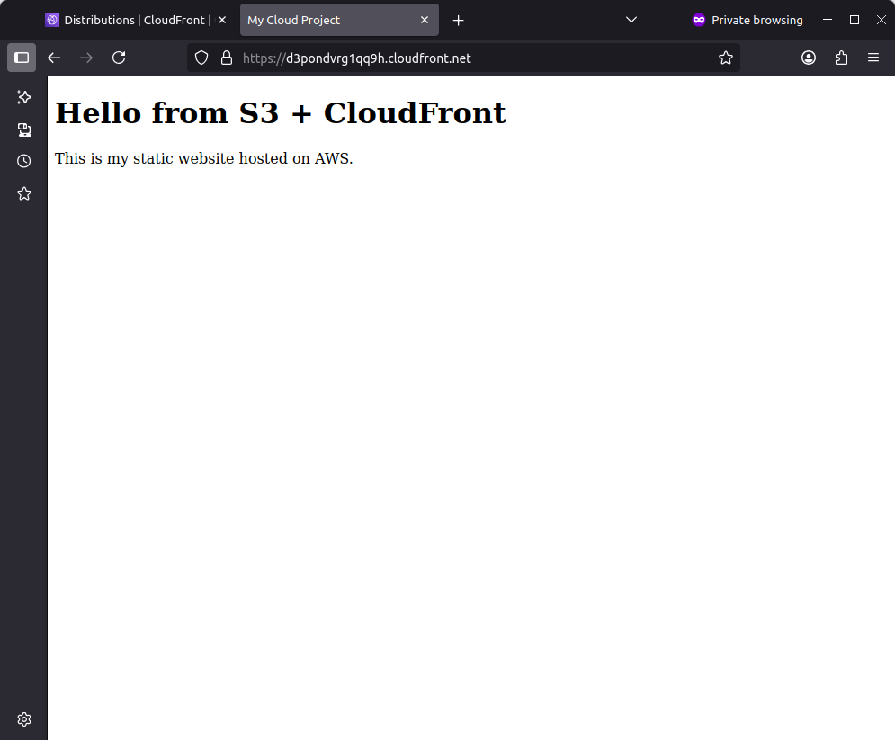

# Static Website Hosting with S3 and CloudFront

## Overview

This project shows how to deploy a static website on AWS using Amazon S3 and CloudFront.
The website is hosted in S3 and delivered globally through CloudFront for improved performance and availability.

---

## Architecture
User → CloudFront → S3 (Static Website)

---

## Services Used
- Amazon S3 (static website hosting)
- Amazon CloudFront (content delivery and caching)

---

## Configuration Steps

### Website Creation
- Created a simple HTML page (index.html)

### S3 Bucket Setup
- Created an S3 bucket
- Disabled block public access
- Enabled static website hosting
- Uploaded website files
- 
### Bucket Policy
- Configured a bucket policy to allow public read access
- 
### CloudFront Distribution
- Created a CloudFront distribution
- Configured the S3 bucket as the origin
- Set default root object to index.html
- Enabled HTTP to HTTPS redirection

---

## Functionality
- Hosted a static website using Amazon S3
- Delivered content globally using CloudFront
- Improved performance using caching
- Enabled HTTPS access via CloudFront

---

## Screenshots

### S3 Static Hosting

### Bucket Policy

### Website via S3

### CloudFront Distribution

### Website via CloudFront

---

## Key Skills Demonstrated
- S3 static website hosting configuration
- CloudFront distribution setup
- Understanding of CDN and caching behavior
- Managing public access using bucket policies

---

## Author
Jelena
